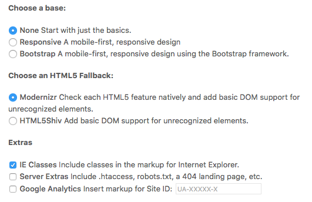
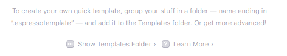
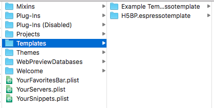
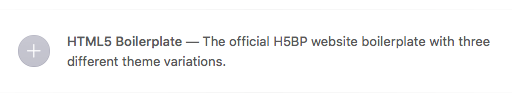

# HTML5 Boilerplate Template for Espresso

The un-official H5BP website boilerplate template for Espresso (espressoapp.com)
, the macOS Editor App.

**_[Espresso][espressoapp] are the original authors of this template, I have
simply taken what they have provided in the application already and upgraded it
to use all of the latest projects. I found the bundled version was too outdated
and needed upgrading/maintaining._**

###### Table of Contents

- [What is Included](#what-is-included)
    - [Vendor Scripts](#vendor-scripts)
    - [Theme Templates](#theme-templates)
    - [Theme Options](#theme-options)
- [Getting Started](#getting-started)
  - [Prerequisites](#prerequisites)
  - [Installing](#installing)
    - [In Espresso](#in-espresso)
    - [Via Terminal](#via-terminal)
- [Contributing](#contributing)
- [Code of Conduct](#code-of-conduct)
- [Versioning](#versioning)
- [Change-Log](#change-log)
- [Authors](#authors)
- [License](#license)
- [Acknowledgements](#acknowledgements)

## What is Included

The following come included in this template for `Espresso`.

### Vendor Scripts

The following vendor scripts are included in the template and have all been
upgraded from their original versions.

1. [Bootstrap 3.3.7][bootstrap] - from version 3.1.1
2. [jQuery 3.3.1][jquery] - from version 1.11.0
3. [Modernizr 3.6.0][modernizr] - from version 2.6.2
4. [Respond.js 1.4.2][respond] - from version 1.1.0
5. [html5shiv 3.7.3][html5shiv] - from version 3.6

### Theme Templates

H5BP website boilerplate template for Espresso has also been upgrade from
version 4.6.0 to version 6.1.0. The template includes the following three
variations:

1. Blank HTML5 starter template with only jQuery included.
2. Responsive starter template with jQuery and Respond.js.
3. Bootstrap Jumbotron template with jQuery and Respond.js.

You have the choice of either `Modernizr` or `html5shiv` as the HTML5 fallback
with each of the three options above.

### Theme Options

The following screenshot outlines the various options available to you when you
create a _New Project_ within `Espresso`.



## Getting Started

These instructions will get the H5BP template installed on your macOS machine.

### Prerequisites

You will need a copy of [Espresso][espressoapp] running on `macOS`.

### Installing

There are two methods to installing this template and these are documented
below.

#### In Espresso

- Download the template by [clicking this link][code].
- Extract the zip folder.
- Open up your `Espresso.app` application on your machine.
- Click `File` -> `New Project`
   (or <kbd>Shift</kbd>+<kbd>Command</kbd>+<kbd>N</kbd>)
- Click `Show Templates Folder`



- Copy the extracted folder (called `H5BP.espressotemplate`) to the `Templates`
  directory that has just opened up.



The new template should now be available for you to use in the `Espresso` app:



#### Via Terminal

- Open up your `Terminal.app` application on your machine.
- Run the following commands to checkout the project directly to your
  `Templates` folder:

```terminal
$ cd ~/Library/Application\ Support/Espresso/Templates/
$ git clone https://github.com/justinhartman/H5BP.espressotemplate.git
```

You can now open up `Espresso.app` and the template will be available to you
when you click on `New Project`.


## Contributing

Please read the [CONTRIBUTING.md][CONTRIBUTING] file for details on how you
can get involved in the project as well as the process for submitting bugs
and pull requests.

## Code of Conduct

Please read the [CODE_OF_CONDUCT.md][COC] file for the guidelines that govern
the community.

## Versioning

We use [Semantic Versioning][semver] for software versions of this project.
For a list of all the versions available, see the [tags][tags] and
[releases][releases] on this repository.

## Change-Log

View the [CHANGELOG.md][changelog] file for a detailed list of changes,
along with specific tasks completed for each version released to date.

## Authors

- Justin Hartman - [@justinhartman][author-1]

Also see the list of [contributors][contribs] who have participated in this
project.

## License

This project is licensed under the `MIT` License. See the
[LICENSE][license] file for full details.

## Acknowledgements

Special thanks go out to the following people and projects.

- [Espresso][espressoapp] - for the included template that this has been
  upgraded from.
- [HTML5Boilerplate][h5bp] - for providing the boilerplates in this template.
- [@justinhartman/.github][.github] - for the Github project templates.

[//]: # (Make sure to change the URL links for `[tags]`, `[releases]`,)
[//]: # (`[contribs]` and `[author-1]` below to your specific project.)

[deploy]: #deployment
[CONTRIBUTING]: CONTRIBUTING.md
[COC]: CODE_OF_CONDUCT.md
[license]: LICENSE
[changelog]: CHANGELOG.md
[semver]: http://semver.org
[tags]: https://github.com/justinhartman/H5BP.espressotemplate/tags
[releases]: https://github.com/justinhartman/H5BP.espressotemplate/releases
[contribs]: https://github.com/justinhartman/H5BP.espressotemplate/contributors
[author-1]: https://github.com/justinhartman
[.github]: https://github.com/justinhartman/.github
[espressoapp]: https://espressoapp.com "Espresso, the Mac Editor."
[code]: https://github.com/justinhartman/H5BP.espressotemplate/archive/master.zip
[h5bp]: https://html5boilerplate.com
[bootstrap]: https://getbootstrap.com/docs/3.3/
[jquery]: https://jquery.com
[modernizr]: https://modernizr.com
[respond]: https://github.com/scottjehl/Respond
[html5shiv]: https://github.com/aFarkas/html5shiv
